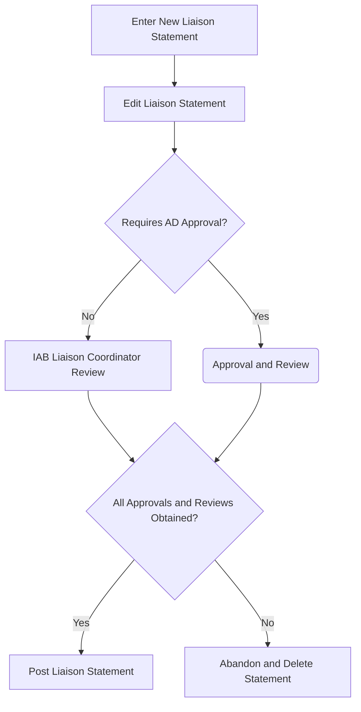

# Refining requirements for the datatracker's liasion management tooling

This is a transitional repository used to organize discussions about the update of the datatracker's liaison management tool. 

## Description of the next liaison tool revision

### Expected workflows

Generally, a statement will be entered, and then edited (perhaps by multiple people). History will capture who entered and has edited the statement.

The editing process will clearly capture whether the statement should be emailed when posted, and allow preview of the emailed message.

When it is ready for review, the IAB Liaison Coordinators will be notified, and if AD approval is required, the ADs will be notified.

Approval will be captured (if approval is required), and review by a IAB Liaison Coordinator will be captured.

Approval and Review can happen in parallel. One is not dependent on the other, and only one Approver and one IAB Liaison Coordinator need to provide an affirmative.

Once approval and review are acquired (whichever occurs last), the liaison statement will be immediately posted, with the posting attributed to the `(System)` user and sent by email if that was selected during editing.

If, at any point prior to posting, a decision to not post the statement is reached, the statement will be deleted (removing it and all history of it).

#### Incoming Liaison Statements

##### Entering and editing an Incoming Liaison Statement

Statements are typically sent by other organization to either statements@ietf.org or to a specific liaison manager.

When a statement is sent to statements@ietf.org, the secretariat will notify the liaison coordinators and, if there are any, the liaison managers for the sending organizations.

It is expected that a liaison manager or liaison coordinator will enter the statement. They may ask the secretariat to do so. 

Once entered, the statement will be available for editing by all of the above roles.

##### Review and Posting of an Incoming Liaison Statement

When any editor deems the statement is ready, the liaison coordinators will be prompted to review.

Note that there is no AD approval required for incoming liaison statements.

Once any liaison coordinator has indicated review is complete, the statement will immediately be posted.

#### Outgoing Liaison Statements

##### Entering and editing an Outgoing Liaison Statement

Statements are entered by persons with a certain role -  one of:
* WG chair, Area Director, IETF Chair, IAB Chair, Liaison Manager, IAB Liaison Coordinator, or Secretariat.

The role the person is acting under when entering the statement will be captured.

Once a statement is entered, the IAB Liaison Coordinators, and any relevant Liaison Managers will be notified.

Those with the above roles (specifically tied to the referenced groups for WG chair and Liaison Manager roles) can edit the statement.

##### Review and Posting of an Outgoing Liaison Statement

When any editor deems the statement is ready, the liaison coordinators will be prompted to review, and if AD approval is necessary, the relevant AD will be prompted to approve.

Approval, review and posting proceed as described in the top level workflow.

### Where email is sent

### Displaying existing liaison statements

### Reworking how liaison attachments are stored and served

